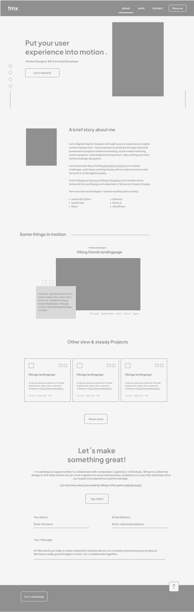
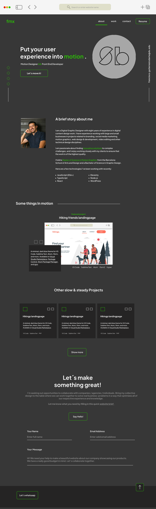

# Portfolio - Francisco GutierrezRodarte
 https://franciscogtzrodarte.github.io/portfolio-franciscogr/
 
## Description

Is my first web developing portfolio to connect with potential clients and just to share with the world my future projects from the Coding Bootcamp at University of Denver.

My goal is to especialize more into the web animations and interactions to make the web apps and website more attractive.

I learn the animation framework FrameMotion building this portfolio and Im feeling really proud of the results. Some developed skills during this challenge: React, Boottrap for react, Framemotion. 

 

## Wireframe

Here is the my first wireframe created in figma.

## Hi-Fi Wireframe

Here is the my High fidelity wireframe created also in figma.

## Deployed site link
https://franciscogtzrodarte.github.io/portfolio-franciscogr/

# Thank your for watching 
 
